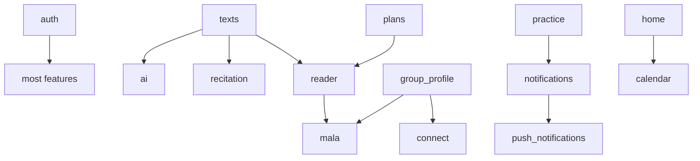

# Feature Module Documentation

This folder and each feature's `doc/README.md` exist so humans **and LLMs** share the same context when working on a feature.

## How to use with an LLM

When asking for a change, **attach the feature path and point to its doc**:

```
@lib/features/mala
Read lib/features/mala/doc/README.md first, then fix …
```

For cross-feature work, attach every involved feature:

```
@lib/features/mala @lib/features/group_profile
Read both doc/README.md files, then …
```

## Feature index

| Feature | Doc | Maturity | Notes |
|---------|-----|----------|-------|
| [ai](../ai/doc/README.md) | AI chat + search | Production | Dedicated AI Dio client |
| [auth](../auth/doc/README.md) | Auth0 + profile | App-critical | Consumed everywhere |
| [calendar](../calendar/doc/README.md) | Tibetan calendar | Production | Hybrid offline engine |
| [connect](../connect/doc/README.md) | Social hub tab | Production | Minimal barrel |
| [explore](../explore/doc/README.md) | Explore tab | **Placeholder** | Not in nav |
| [group_profile](../group_profile/doc/README.md) | Group pages | Production | Heavy provider hub |
| [home](../home/doc/README.md) | Home + main nav | Production | Partial barrel |
| [learn](../learn/doc/README.md) | Learn tab | **Placeholder** | Not in nav |
| [mala](../mala/doc/README.md) | Prayer-bead counter | Production | Also see [mala/README.md](../mala/README.md) |
| [more](../more/doc/README.md) | Me + Settings | Production | Screens at presentation root |
| [notifications](../notifications/doc/README.md) | Local scheduling | Production | Sync engine |
| [onboarding](../onboarding/doc/README.md) | First-run flow | Production | hooks_riverpod in application |
| [plans](../plans/doc/README.md) | Practice plans | Production | Richest module |
| [practice](../practice/doc/README.md) | Practice tab + routine | Production | Hive override required |
| [push_notifications](../push_notifications/doc/README.md) | FCM | Production | Firebase isolated |
| [reader](../reader/doc/README.md) | Text reader | Production | Loads via texts API |
| [recitation](../recitation/doc/README.md) | Recitations | Production | Cache-first lists |
| [texts](../texts/doc/README.md) | Text library | **Foundation** | Breaking changes ripple |
| [timer](../timer/doc/README.md) | Meditation timers | Production | Wall-clock session state |

## Global architecture conventions

Apply these across **all** features unless a feature doc says otherwise.

### Layering (clean architecture)

```
presentation/  → widgets, screens, Riverpod providers/notifiers
domain/        → entities, repository interfaces, use cases
data/          → datasources, models (DTOs), repository implementations
```

- Map **data models → domain entities** at the repository boundary.
- Prefer **one use case per file** in mature features (auth, texts, plans).
- Some features skip use cases (connect) — follow what that feature already does.

### State management

- **Riverpod** (`flutter_riverpod`, sometimes `hooks_riverpod`).
- `Provider` / `FutureProvider` / `StreamProvider` for DI and async data.
- `StateNotifierProvider` for mutable UI state and pagination.
- `.autoDispose.family` for screen-scoped or parametric state.
- `ref.listen` for side effects (navigation, invalidation, sync).

### Error handling

- Domain/data often use **`Either<Failure, T>`** (fpdart).
- Map exceptions → `Failure` in repository impls.
- UI: handle `Left` with friendly messages; strip raw `Exception:` prefixes where existing UI does.

### Auth & guests

- **`authProvider`** — session (logged in, guest, loading).
- **`userProvider`** — profile (separate from session).
- Gate protected actions with login drawer (`LoginDrawer`), not ad-hoc dialogs.
- Persist **`currentUserId`** before auth state flips (race guard for mala, timer, etc.).

### Networking

- Main API: **`dioProvider`** + auth/cache/retry interceptors.
- AI API: **`aiDioProvider`** only in ai feature.
- Protected routes: see `core/config/protected_routes.dart`.

### Localization & content language

- UI strings: l10n via `context.l10n` / `context_ext.dart`.
- Content language: **`contentLanguageProvider`** for API query params.

### UI patterns

- Pair async content with **skeleton widgets** (home, connect, recitation patterns).
- Use **`ResponsiveCoverImage`** / `ResponsiveImage` for CDN images.
- Theme: `AppColors`, `AppTheme`, font config in core.

### Scope discipline (for LLMs)

1. **Minimal diff** — only change what the task requires.
2. **Match surrounding code** — naming, file placement, provider patterns.
3. **Don't over-engineer** — no extra abstractions for one-off logic.
4. **Don't break cross-feature contracts** — especially texts → reader, auth → mala/timer, practice → notifications.
5. **Run existing tests** when touching mala, auth, or repository logic.

## Dependency graph (simplified)



## Keeping docs up to date

When you merge a feature change that alters **behavior, invariants, or architecture**, update that feature's `doc/README.md` in the same PR.

Priority sections to keep accurate:

- **Critical invariants** (e.g. mala monotonic counts)
- **Cross-feature dependencies**
- **How to make changes (LLM playbook)** do/don't lists
- **Key files** table when files move or rename

For mala counting/sync details, maintain **`mala/README.md`** (deep reference) **and** **`mala/doc/README.md`** (LLM entry point).
